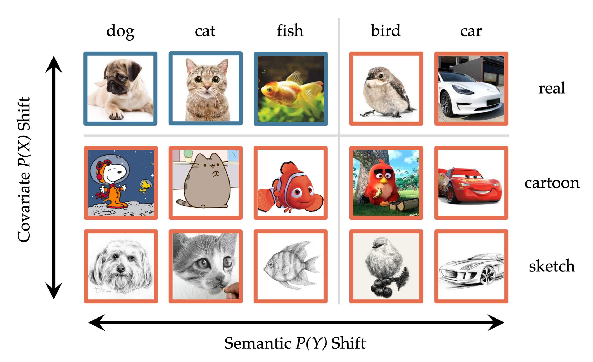
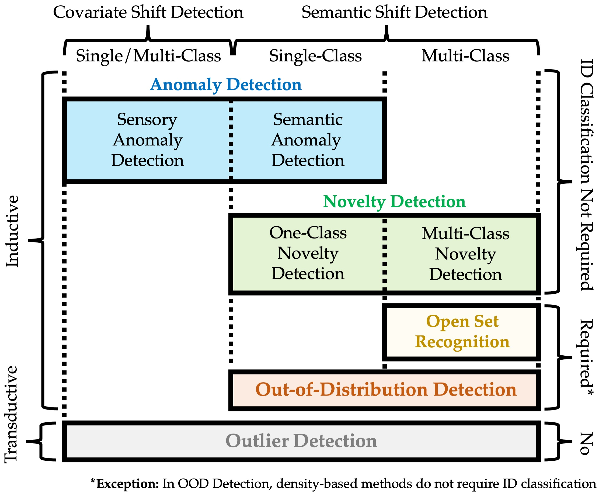

# Generalized Out-of-Distribution Detection: A Survey
[](https://arxiv.org/abs/2110.11334)
&nbsp;
[](https://github.com/Jingkang50/OOD_Detection_Survey/blob/main/Recruit.md)
&nbsp;
[](https://github.com/Jingkang50/OODSurvey/issues)


## 1. Overview
This repository is with our survey paper:


> **Title:** [Generalized Out-of-Distribution Detection: A Survey](https://arxiv.org/abs/2110.11334) <br>
> **Authors:** [Jingkang Yang<sup>1</sup>](https://jingkang50.github.io/), [Kaiyang Zhou<sup>1</sup>](https://kaiyangzhou.github.io/), [Yixuan Li<sup>2</sup>](http://pages.cs.wisc.edu/~sharonli/), [Ziwei Liu<sup>1</sup>](https://github.com/liuziwei7) <br>
> **Institutions:** [<sup>1</sup>MMLab@NTU](https://www.mmlab-ntu.com/), [<sup>2</sup>University of Wisconsin-Madison](https://www.cs.wisc.edu/).


This survey comprehensively reviews the similar topics of **outlier detection (OD)**, **anomaly detection (AD)**, **novelty detection (ND)**, **open set recognition (OSR)**, and **out-of-distribution (OOD) detection**, extensively compares their commomality and differences, and eventually unifies them under a big umbrella of "generalized OOD detection" framework.

We hope that this survey can help readers and participants better understand the open-world field centered on OOD detection. At the same time, it urges future work to learn, compare, and develop ideas and methods from the broader scope of generalized OOD detection, with clear problem definition and proper benchmarking.

We prepare this repository for the following two reasons:
1. We consider it an awesome list to easily access the references mentioned in the paper Table 1. We also believe this list will continue to include more promising works as new works appear. Please feel free to nominate good related works with [Pull Requests](https://github.com/Jingkang50/OOD_Detection_Survey/pulls). 
2. We hope this repository becomes a discussion panel for readers to ask questions, raise concerns, and make constructive comments for the broad generalized OOD detection field. Please feel free to post your ideas in the [Issues](https://github.com/Jingkang50/OOD_Detection_Survey/issues).

We are also planning to build an evaluation benchmark to compare representative generalized OOD detection methods from *every* sub-task to further unify the field. The work will be collaborated with SenseTime EIG Research, which recently have many full-time researcher openings for this benchmarking project and other OOD-related research. Check their [Recruitment Info](https://github.com/Jingkang50/OOD_Detection_Survey/blob/main/Recruit.md) for more information.


 | 
:-----------------------------:|:-------------------------:
**Fig.1.1**: Two kinds of distribution shift to assist better understanding of our framework. | **Fig.1.2**: Taxonomy diagram of generalized OOD detection framework. 

## 2. Taxonomy
- [2.1 Anomaly Detection](https://github.com/Jingkang50/OOD_Detection_Survey/blob/main/2_Taxonomy.md#2.1)
  - [2.1.1 Sensory Anomaly Detection](https://github.com/Jingkang50/OOD_Detection_Survey/blob/main/2_Taxonomy.md#2.1.1)
  - [2.1.2 Semantic Anomaly Detection](https://github.com/Jingkang50/OOD_Detection_Survey/blob/main/2_Taxonomy.md#2.1.2)
- [2.2 Novelty Detection](https://github.com/Jingkang50/OOD_Detection_Survey/blob/main/2_Taxonomy.md#2.2)
  - [2.2.1 One-Class Novelty Detection](https://github.com/Jingkang50/OOD_Detection_Survey/blob/main/2_Taxonomy.md#2.2.1)
  - [2.2.2 Multi-Class Novelty Detection](https://github.com/Jingkang50/OOD_Detection_Survey/blob/main/2_Taxonomy.md#2.2.2)
- [2.3 Open Set Recognition](https://github.com/Jingkang50/OOD_Detection_Survey/blob/main/2_Taxonomy.md#2.3)
- [2.4 Out-of-Distribution Detection](https://github.com/Jingkang50/OOD_Detection_Survey/blob/main/2_Taxonomy.md#2.4)
- [2.5 Outlier Detection](https://github.com/Jingkang50/OOD_Detection_Survey/blob/main/2_Taxonomy.md#2.5)
- [2.6 Discussion](https://github.com/Jingkang50/OOD_Detection_Survey/blob/main/2_Taxonomy.md#2.5)


## 3. Anomaly Detection & One-Class Novelty Detection
- [3.1 Density-based Methods](https://github.com/Jingkang50/OOD_Detection_Survey/blob/main/3_AD.md#3.1)
  - [3.1.1 Classic Density Estimation](https://github.com/Jingkang50/OOD_Detection_Survey/blob/main/3_AD.md#3.1.1)
  - [3.1.2 NN-based Density Estimation](https://github.com/Jingkang50/OOD_Detection_Survey/blob/main/3_AD.md#3.1.2)
  - [3.1.3 Energy-based Model](https://github.com/Jingkang50/OOD_Detection_Survey/blob/main/3_AD.md#3.1.3)
  - [3.1.4 Frequency-based Model](https://github.com/Jingkang50/OOD_Detection_Survey/blob/main/3_AD.md#3.1.4)
- [3.2 Reconstruction-based Methods](https://github.com/Jingkang50/OOD_Detection_Survey/blob/main/3_AD.md#3.2)
  - [3.2.1 Sparse Representation Methods](https://github.com/Jingkang50/OOD_Detection_Survey/blob/main/3_AD.md#3.2.1)
  - [3.2.2 Reconstruction-Error Methods](https://github.com/Jingkang50/OOD_Detection_Survey/blob/main/3_AD.md#3.2.2)
- [3.3 Classification-based Methods](https://github.com/Jingkang50/OOD_Detection_Survey/blob/main/3_AD.md#3.3)
  - [3.3.1 One-Class Classification](https://github.com/Jingkang50/OOD_Detection_Survey/blob/main/3_AD.md#3.3.1)
  - [3.3.2 Positive-Unlabeled Learning](https://github.com/Jingkang50/OOD_Detection_Survey/blob/main/3_AD.md#3.3.2)
  - [3.3.3 Self-Supervised Learning](https://github.com/Jingkang50/OOD_Detection_Survey/blob/main/3_AD.md#3.3.3)
- [3.4 Distance-based Methods](https://github.com/Jingkang50/OOD_Detection_Survey/blob/main/3_AD.md#3.4)
- [3.5 Gradient-based Methods](https://github.com/Jingkang50/OOD_Detection_Survey/blob/main/3_AD.md#3.5)
- [3.6 Discussion and Theoretical Analysis](https://github.com/Jingkang50/OOD_Detection_Survey/blob/main/3_AD.md#3.6)


## 4. Multi-Class Novelty Detection & Open Set Recognition
- [4.1 Classfication-based Methods](https://github.com/Jingkang50/OOD_Detection_Survey/blob/main/4_OSR.md#4.1)
  - [4.1.1 EVT-based Calibration](https://github.com/Jingkang50/OOD_Detection_Survey/blob/main/4_OSR.md#4.1.1)
  - [4.1.2 EVT-free Calibration](https://github.com/Jingkang50/OOD_Detection_Survey/blob/main/4_OSR.md#4.1.2)
  - [4.1.3 Unknown Class Generation](https://github.com/Jingkang50/OOD_Detection_Survey/blob/main/4_OSR.md#4.1.3)
  - [4.1.4 Label Space Redesign](https://github.com/Jingkang50/OOD_Detection_Survey/blob/main/4_OSR.md#4.1.4)
- [4.2 Distance-based Methods](https://github.com/Jingkang50/OOD_Detection_Survey/blob/main/4_OSR.md#4.2)
- [4.3 Reconstruction-based Methods](https://github.com/Jingkang50/OOD_Detection_Survey/blob/main/4_OSR.md#4.3)
  - [4.3.1 Sparse Representation Methods](https://github.com/Jingkang50/OOD_Detection_Survey/blob/main/4_OSR.md#4.3.1)
  - [4.3.2 Reconstruction-Error Methods](https://github.com/Jingkang50/OOD_Detection_Survey/blob/main/4_OSR.md#4.3.2)


## 5. Out-of-Distribution Detection
- [5.1 Classfication-based Methods](https://github.com/Jingkang50/OOD_Detection_Survey/blob/main/5_OOD.md#5.1)
  - [5.1.0 Baseline](https://github.com/Jingkang50/OOD_Detection_Survey/blob/main/5_OOD.md#5.1.0)
  - [5.1.1 Output-based Methods](https://github.com/Jingkang50/OOD_Detection_Survey/blob/main/5_OOD.md#5.1.1)
    - [5.1.1.1 Post-hoc Detection](https://github.com/Jingkang50/OOD_Detection_Survey/blob/main/5_OOD.md#5.1.1.1)
    - [5.1.1.2 Confidence Enhancement](https://github.com/Jingkang50/OOD_Detection_Survey/blob/main/5_OOD.md#5.1.1.2)
    - [5.1.1.3 Outlier Exposure](https://github.com/Jingkang50/OOD_Detection_Survey/blob/main/5_OOD.md#5.1.1.3)
  - [5.1.2 OOD Data Generation](https://github.com/Jingkang50/OOD_Detection_Survey/blob/main/5_OOD.md#5.1.3)
  - [5.1.3 Gradient-based Methods](https://github.com/Jingkang50/OOD_Detection_Survey/blob/main/5_OOD.md#5.1.4)
  - [5.1.4 Bayesian Models](https://github.com/Jingkang50/OOD_Detection_Survey/blob/main/5_OOD.md#5.1.4)
  - [5.1.5 Large-scale OOD Detection](https://github.com/Jingkang50/OOD_Detection_Survey/blob/main/5_OOD.md#5.1.5)
- [5.2 Density-based Methods](https://github.com/Jingkang50/OOD_Detection_Survey/blob/main/5_OOD.md#5.2)
- [5.3 Distance-based Methods](https://github.com/Jingkang50/OOD_Detection_Survey/blob/main/5_OOD.md#5.3)


## 6. Outlier Detection
- [6.1 Density-based Methods](https://github.com/Jingkang50/OOD_Detection_Survey/blob/main/6_Outlier.md#6.1)
- [6.2 Distance-based Methods](https://github.com/Jingkang50/OOD_Detection_Survey/blob/main/6_Outlier.md#6.2)
  - [6.2.1 Cluster-based Methods](https://github.com/Jingkang50/OOD_Detection_Survey/blob/main/6_Outlier.md#6.2.1)
  - [6.2.2 Graph-based Methods](https://github.com/Jingkang50/OOD_Detection_Survey/blob/main/6_Outlier.md#6.2.2)
- [6.3 Classification-based Methods](https://github.com/Jingkang50/OOD_Detection_Survey/blob/main/6_Outlier.md#6.3)

## 7. Challenges and Future Direction
- [7.1 Challenges](https://github.com/Jingkang50/OOD_Detection_Survey/blob/main/7_Outlook.md#7.1)
  - [7.1.1 Proper Evaluation and Benchmarking](https://github.com/Jingkang50/OOD_Detection_Survey/blob/main/7_Outlook.md#7.1.1)
  - [7.1.2 Outlier-free OOD Detection](https://github.com/Jingkang50/OOD_Detection_Survey/blob/main/7_Outlook.md#7.1.2)
  - [7.1.3 Tradeoff Between Classification and OOD Detection](https://github.com/Jingkang50/OOD_Detection_Survey/blob/main/7_Outlook.md#7.1.3)
  - [7.1.4 Real-world Benchmarks and Evaluations](https://github.com/Jingkang50/OOD_Detection_Survey/blob/main/7_Outlook.md#7.1.4)
- [7.2  Future Directions](https://github.com/Jingkang50/OOD_Detection_Survey/blob/main/7_Outlook.md#7.2)
  - [7.2.1 Methodologies across Sub-tasks](https://github.com/Jingkang50/OOD_Detection_Survey/blob/main/7_Outlook.md#7.2.1)
  - [7.2.2 OOD Detection & OOD Generalization](https://github.com/Jingkang50/OOD_Detection_Survey/blob/main/7_Outlook.md#7.2.2)
  - [7.2.3 OOD Detection & Open-Set Noisy Labels](https://github.com/Jingkang50/OOD_Detection_Survey/blob/main/7_Outlook.md#7.2.3)
  - [7.2.4 Theoretical Analysis](https://github.com/Jingkang50/OOD_Detection_Survey/blob/main/7_Outlook.md#7.2.4)


## 8. Conclusion
In this survey, we comprehensively review five topics: AD, ND, OSR, OOD detection, and OD, and unify them as a framework of *generalized OOD detection*. By articulating the motivations and definitions of each sub-task, we encourage follow-up works to accurately locate their target problems and find the most suitable benchmarks.
By sorting out the methodologies for each sub-task, we hope that readers can easily grasp the mainstream methods, identify suitable baselines, and contribute future solutions in light of existing ones.
By providing insights, challenges, and future directions, we hope that future works will pay more attention to the existing problems and explore more interactions across other tasks within or even outside the scope of generalized OOD detection.


## 

## Citation
If you find our survey and repository useful for your research, please consider citing our paper:
```bibtex
@article{yang2021oodsurvey,
  title={Generalized Out-of-Distribution Detection: A Survey},
  author={Yang, Jingkang and Zhou, Kaiyang and Li, Yixuan and Liu, Ziwei},
  journal={arXiv preprint arXiv:2110.11334},
  year={2021}
}
```


## Acknowledgements
This repository is created and maintained by Jingkang Yang and Peng Wenxuan from NTU; Kunyuan Ding, Zixu Song, Pengyun Wang, Zitang Zhou, and Dejian Zou from BUPT.
