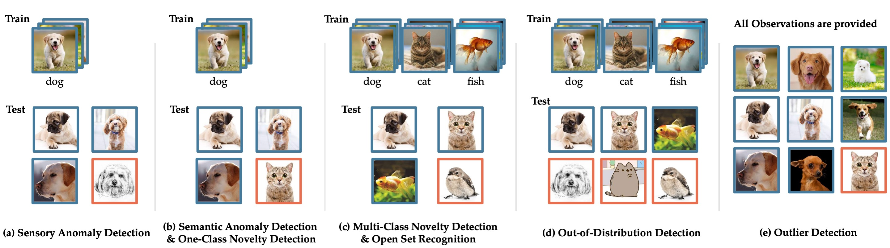
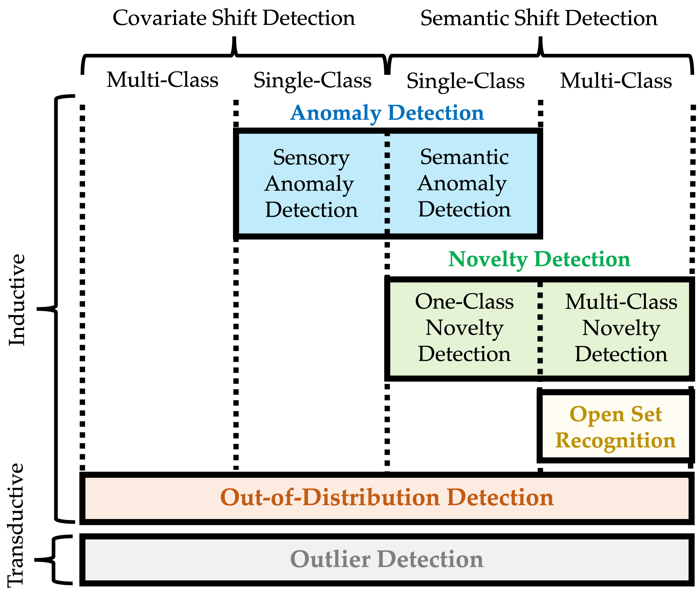

# Generalized Out-of-Distribution Detection in Computer Vision: A Survey

## 0. Overview

## 1. Introduction
 | 
:-----------------------------:|:-------------------------:
Fig.1.1: Two kinds of distribution shifts that can be recognized as OOD. | Fig.1.2: Taxonomy diagram of generalized OOD detection framework.  

## 2. Taxonomy
- [2.1 Anomaly Detection](https://github.com/Jingkang50/OOD_Detection_Survey/blob/main/Taxonomy.md#2.1)
  - [2.1.1 Sensory Anomaly Detection](https://github.com/Jingkang50/OOD_Detection_Survey/blob/main/Taxonomy.md#2.1.1)
  - [2.1.2 Semantic Anomaly Detection](https://github.com/Jingkang50/OOD_Detection_Survey/blob/main/Taxonomy.md#2.1.2)
- [2.2 Novelty Detection](https://github.com/Jingkang50/OOD_Detection_Survey/blob/main/Taxonomy.md#2.2)
  - [2.2.1 One-Class Novelty Detection](https://github.com/Jingkang50/OOD_Detection_Survey/blob/main/Taxonomy.md#2.2.1)
  - [2.2.2 One-Class Novelty Detection](https://github.com/Jingkang50/OOD_Detection_Survey/blob/main/Taxonomy.md#2.2.2)
- [2.3 Open Set Recognition](https://github.com/Jingkang50/OOD_Detection_Survey/blob/main/Taxonomy.md#2.3)
- [2.4 Out-of-Distribution Detection](https://github.com/Jingkang50/OOD_Detection_Survey/blob/main/Taxonomy.md#2.4)
- [2.5 Outlier Detection](https://github.com/Jingkang50/OOD_Detection_Survey/blob/main/Taxonomy.md#2.5)

## 3. Anomaly Detection & One-Class Novelty Detection
- [3.1 Density-based Method](https://github.com/Jingkang50/OOD_Detection_Survey/blob/main/AD.md#3.1)
  - [3.1.1 Classic Density Estimation](https://github.com/Jingkang50/OOD_Detection_Survey/blob/main/AD.md#3.1.1)
  - [3.1.2 NN-based Density Estimation](https://github.com/Jingkang50/OOD_Detection_Survey/blob/main/AD.md#3.1.2)
  - [3.1.3 Energy-based Model](https://github.com/Jingkang50/OOD_Detection_Survey/blob/main/AD.md#3.1.3)
- [3.2 Reconstruction-based Method](https://github.com/Jingkang50/OOD_Detection_Survey/blob/main/AD.md#3.2)
  - [3.2.1 Sparse Representation Method](https://github.com/Jingkang50/OOD_Detection_Survey/blob/main/AD.md#3.2.1)
  - [3.2.2 Reconstruction-Error Method](https://github.com/Jingkang50/OOD_Detection_Survey/blob/main/AD.md#3.2.2)
- [3.3 Classification-based Method](https://github.com/Jingkang50/OOD_Detection_Survey/blob/main/AD.md#3.3)
  - [3.3.1 One-Class Classification](https://github.com/Jingkang50/OOD_Detection_Survey/blob/main/AD.md#3.3.1)
  - [3.3.2 Positive-Unlabeled Learning](https://github.com/Jingkang50/OOD_Detection_Survey/blob/main/AD.md#3.3.2)
  - [3.3.3 Self-Supervised Learning](https://github.com/Jingkang50/OOD_Detection_Survey/blob/main/AD.md#3.3.3)
- [3.4 Distance-based Method](https://github.com/Jingkang50/OOD_Detection_Survey/blob/main/AD.md#3.4)
- [3.5 Meta-Learning-based Method](https://github.com/Jingkang50/OOD_Detection_Survey/blob/main/AD.md#3.5)
- [3.6 Hybrid Methods and Others](https://github.com/Jingkang50/OOD_Detection_Survey/blob/main/AD.md#3.6)

## 4. Multi-Class Novelty Detection & Open Set Recognition
- [4.1 Classfication-based Method](https://github.com/Jingkang50/OOD_Detection_Survey/blob/main/OSR.md#4.1)
  - [4.1.1 EVT-based Uncertainty Calibration](https://github.com/Jingkang50/OOD_Detection_Survey/blob/main/OSR.md#4.1.1): OpenMax
  - [4.1.2 Unknown Class Generation](https://github.com/Jingkang50/OOD_Detection_Survey/blob/main/OSR.md#4.1.2)
- [4.2 Distance-based Method](https://github.com/Jingkang50/OOD_Detection_Survey/blob/main/OSR.md#4.2)
- [4.3 Reconstruction-based Method](https://github.com/Jingkang50/OOD_Detection_Survey/blob/main/OSR.md#4.3)
  - [4.3.1 Sparse Representation Method](https://github.com/Jingkang50/OOD_Detection_Survey/blob/main/OSR.md#4.3.1)
  - [4.3.2 Reconstruction-Error Method](https://github.com/Jingkang50/OOD_Detection_Survey/blob/main/OSR.md#4.3.2)
- [4.4 Hybrid Methods and Others](https://github.com/Jingkang50/OOD_Detection_Survey/blob/main/OSR.md#4.4)

## 5. Out-of-Distribution Detection
- [5.1 Classfication-based Method](https://github.com/Jingkang50/OOD_Detection_Survey/blob/main/OOD.md#5.1)
  - [5.1.0 Baseline](https://github.com/Jingkang50/OOD_Detection_Survey/blob/main/OOD.md#5.1.0)
  - [5.1.1 Confidence Calibration](https://github.com/Jingkang50/OOD_Detection_Survey/blob/main/OOD.md#5.1.1)
    - [5.1.1.1 Post-hoc Calibration](https://github.com/Jingkang50/OOD_Detection_Survey/blob/main/OOD.md#5.1.1.1)
    - [5.1.1.2 Bayesian Methods](https://github.com/Jingkang50/OOD_Detection_Survey/blob/main/OOD.md#5.1.1.2)
    - [5.1.1.3 Other Confidence Enhancement Methods](https://github.com/Jingkang50/OOD_Detection_Survey/blob/main/OOD.md#5.1.1.3)
  - [5.1.2 Outlier Explosure](https://github.com/Jingkang50/OOD_Detection_Survey/blob/main/OOD.md#5.1.2)
  - [5.1.3 OOD Data Generation](https://github.com/Jingkang50/OOD_Detection_Survey/blob/main/OOD.md#5.1.3)
  - [5.1.4 Label Space Redesign](https://github.com/Jingkang50/OOD_Detection_Survey/blob/main/OOD.md#5.1.4)
  - [5.1.5 Big Pretrained Model](https://github.com/Jingkang50/OOD_Detection_Survey/blob/main/OOD.md#5.1.5)
- [5.2 Density-based Method](https://github.com/Jingkang50/OOD_Detection_Survey/blob/main/OOD.md#5.2)
  - [5.2.1 Embedding-based Method](https://github.com/Jingkang50/OOD_Detection_Survey/blob/main/OOD.md#5.1.1)
  - [5.2.2 Flow-based Methods](https://github.com/Jingkang50/OOD_Detection_Survey/blob/main/OOD.md#5.1.2)
  - [5.2.3 Energy-based Methods](https://github.com/Jingkang50/OOD_Detection_Survey/blob/main/OOD.md#5.1.3)
- [5.3 Distance-based Method](https://github.com/Jingkang50/OOD_Detection_Survey/blob/main/OOD.md#5.3)
- [5.4 Meta-Learning-based Method](https://github.com/Jingkang50/OOD_Detection_Survey/blob/main/OOD.md#5.4)
- [5.5 Hybrid Methods and Others](https://github.com/Jingkang50/OOD_Detection_Survey/blob/main/OOD.md#5.5)

## 6. Outlier Detection

## 7. Related Tasks
Learning with Rejection
Learning from Open-Set Noisy Labels
Open-Set Semi-Supervised Learning

Domain Adaptation
Open-Set Domain Adaptation

Domain Generalization
Transfer Anomaly Detection
Zero-Shot Learning

Novelty Discovery
Open-World Recognition
